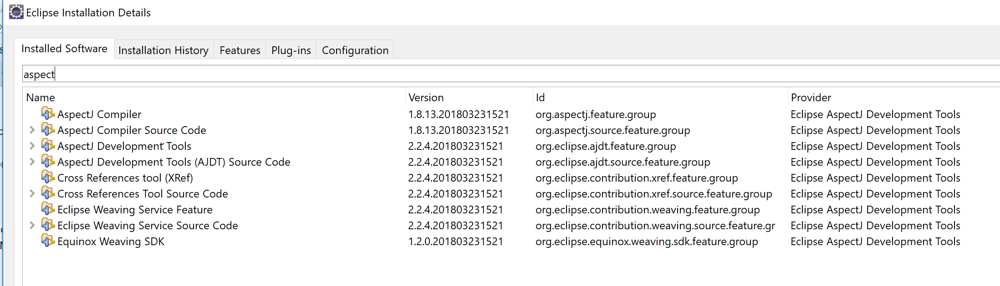

# hadoop-and-spark-exploration

 
## Objectifs
Le code et les exemples contenus dans ce repository ont eu pour objectifs de se familiariser avec l'environnement Hadoop/Spark, ainsi que le développement d'une application Spark en language Java.

## Priorités
Spark étant un sujet "relativement" vaste et complexe (tant en terme d'APIs que de configurations de déploiement - et même que de configuration tout court !), j'ai du établir un choix drastique quant aux APIs que j'allais aborder ici.

Le thème initialement retenu était l'étude des différentes possibilités et techniques de JOINTURE de datasets avec Spark, les jointures sur de gros volumes étant toujours une source de lenteurs et d'erreurs d'exécution (OOM, No space left on disk, ...).<br>
A date, le code ne reflète pas ce choix initial.

## Choix de la version de Spark

J'ai choisi de travailler avec une version Spark 2.x récente. Je me suis aligné sur la version de la distribution que j'allais employer pour les tests, à savoir [Hortonworks Data Platform 2.6.4](https://docs.hortonworks.com/HDPDocuments/HDP2/HDP-2.6.4/bk_release-notes/content/comp_versions.html) qui supporte la version 2.2.

## Datasets
[The movielens data ml-latest.zip](https://grouplens.org/datasets/movielens/latest/)

## Réalisation
En terme d'APIs, j'ai choisi d'utiliser et de comparer les 3 APIs disponibles, à savoir Dataset, Dataframe et "RDD classic".<br>

La phase de réalisation m'a confronté à des obstacles plus prosaïques que le sujet initial. A titre d'exemple:
- la lenteur d'exécution des tests unitaires nécessitant une SparkSession m'a conduit à rechercher une solution et retenir au final l'annotation <code>SparkTest</code></li>


## Résultats
A date, le repository contient:
- des scripts de chargements d'un dataset et leur chargement dans HIVE
- deux taches <code>FindMoviesWithLowestAvgRating</code> et <code>GroupMoviesByRatings</code> qui contiennnent différentes implémentations (DF, DS, RDD) de la même fonctionnalité, en ajoutant parfois une "erreur de programmation" (ex.: oublier une projection) en vue d'en mesurer l'impact sur les performances
- les classes de tests unitaires correspondantes
- un <code>Aspect</code> permettant d'adjoindre aux taches un timer, et de réaliser par la suite un benchmark comparatif des implémentations et/ou des configurations de déploiement
- un programme <code>Main</code> principal qui exécute les taches
- un script de lancement du programme via <code>spark-submit</code>

## Exploitation
### Pré-requis
#### Pré-requis / environnement de build (ici poste local)

- Git
- Java 8+
- Maven 3.3+ doit être installé afin de builder le programme
- Optionnellement (pour un build au sein d'un IDE (Eclipse, Intellij, ...): 
  - l'installation des plugins AspectJ dédiés à cet IDE est nécessaire
  - à défaut, le code sera fonctionnel, mais les temps d'exécution ne sont ni calculés, ni consignés par le logger.



#### Pré-requis / environnement d'exécution (ici noeud driver)
- Un environnement Hadoop (HDFS, HIVE) + Spark 2.x est nécessaire
- Un compte utilisateur accessible via ssh, et pour lequel l'environnement Hadoop/Spark est accessible et configuré
- pour la création de la base HIVE et le chargement des données, les scripts de chargement nécessitent l'outil en ligne de commande `beeline`
- les scripts de chargement nécessitent que `bash` soit configuré comme shell par défaut via un lien sur `/bin/sh` (au besoin, le #shebang des scripts .sh pourra être modifié).


### Installation
L'installation décrite ici repose sur les éléments suivant:
- <b>un poste local</b>
    - sur lequel est cloné le présent repository git
    - et à partir duquel on peut explorer le code avec un IDE et réaliser le `build`
- <b>un noeud driver</b> participant à un cluster Hadoop Spark
    - vers lequel sont copiés les scripts et .jar nécessaires
    - et depuis lequel est exécuté le programme contenu dans ce repository.

Naturellement, il est également possible de cloner le repository et réaliser le build directement depuis le noeud driver.

#### Etape 1: clone du repository

Sur Windows uniquement  (configuration git pour prévenir les problèmes liés à l'introduction de CRLF):

```
git config core.autocrlf input
git config core.eol lf
```
Récupération du repository:

```
git clone https://github.com/PhilGBr/hadoopandsparkexploring.git
```


#### Etape 2: paramétrage des variables d'environnement pour le chargement des données
```
cd hadoopandsparkexploring
vi scripts/data_preparation/00_env.sh
```
Vérifier et modifier si besoin les variables suivantes:<br>

```
export LOCAL_MOVIELENS_DATADIR=~/tmp/movielens   // (stockage du dataset sur le fs local du noeud driver)
export HDFS_MOVIELENS_DATADIR=/tmp/data/movielens-data-200  // (stockage du dataset sous HDFS)
export HDFS_MOVIELENS_DATADIR_FOR_HIVE=/tmp/data/movielens-data-200-copy-for-hive // (copie du dataset sous HDFS)
```


```
export HIVE2_PROTOCOL="jdbc:hive2"
export HIVE2_HOST="sandbox.hortonworks.com"
export HIVE2_IP="10000"
export HIVE2_DEFAULT_DB="default"
#If no extra connection string parameters are required, leave it blank
export HIVE2_EXTRA_CNX_STRING_PARAM=""
```

#### Etape 3: copie des scripts sur le noeud driver
##### Etape 3.1: preparation des répertoires sur le fs local du driver

Se connecter au noeud driver, et préparer les répertoires cibles

```
ssh -p <port> -i </some/patch/to/rsa_private_key> <user>@<ip>
mkdir spark-test
cd spark-test
mkdir scripts
exit
```


##### Etape 3.2: copie depuis le poste (de dev) sur le fs local du driver

```
scp -P <port> -i </some/patch/to/rsa_private_key> scripts/data_preparation/* <user><ip>:~/spark-test/scripts
scp -P <port> -i </some/patch/to/rsa_private_key> scripts/launching/run_with_spark-submit.sh <user>@<ip>:~/spark-test
```

#### Etape 4: Build du progamme
`mvn package`

#### Etape 5: Déploiement sur le driver
`scp -P <port> -i </some/patch/to/<rsa_private_key> target/*.jar <user>@<ip>:~/spark-test`

#### Etape 6: Configuration log4j
**Notes:**
- Il existe différentes façons de (re-)configurer log4j pour une application Spark, qui varient selon le mode de soumission du job à exécuter, et la partie de code ciblée par la modification de configuration
- En l'occurrence, la modification de configuration log4j impacte uniquement du code exécuté par le driver
 Par ailleurs, la soumission de job spark se fait en mode `'client'`
- Il n'est donc pas nécessaire ici de propager la configuration aux executors


##### Etape 6.1: localisation du fichier à modifier

Localiser le fichier log4j.properties de la distribution Spark installée sur le driver.

<u>Exemple:</u>

pour la distribution HDP 2.6.4 d'Hortonworks, en étant loggué en tant que `maria_dev`, le fichier se trouve sous  `/etc/spark2/2.6.4.0-91/0/log4j.properties`

##### Etape 6.2: édition du fichier

Editer le fichier, et ajouter la configuration suivante <span style="color:red">(en prenant soin de modifier les chemins vers les 2 fichiers de logs configurés)</span>:

```
log4j.logger.philgbr.exploration.spark=INFO, console, explorationFileAppender
log4j.additivity.philgbr.exploration.spark=false

log4j.appender.explorationFileAppender=org.apache.log4j.FileAppender
log4j.appender.explorationFileAppender.File=/tmp/spark-test/spark-exploration.log
log4j.appender.explorationFileAppender.layout=org.apache.log4j.PatternLayout
log4j.appender.explorationFileAppender.layout.ConversionPattern=%d{yy/MM/dd HH:mm:ss.SSS} %p %c{1}: %m%n

log4j.logger.philgbr.exploration.spark.utils.LogExecutionTime=INFO, console, exectimeFileAppender
log4j.additivity.philgbr.exploration.spark.utils.LogExecutionTime=true

log4j.appender.exectimeFileAppender=org.apache.log4j.FileAppender
log4j.appender.exectimeFileAppender.File=/tmp/spark-test/spark-tasks-execution-time.log
log4j.appender.exectimeFileAppender.layout=org.apache.log4j.PatternLayout
log4j.appender.exectimeFileAppender.layout.ConversionPattern=%d{yy/MM/dd HH:mm:ss.SSS} %p %c{1}: %m%n
```

#### Etape 7: Lancement du programme depuis le noeud driver
Se connecter au noeud driver:

```
ssh -p <port> -i </some/patch/to/rsa_private_key> <user>@<ip>
cd spark-test
```

Editer le fichier `run_with_spark-submit.sh` et <u>modifier si besoin</u> la valeur de la variable `MASTER_URL`:

```
vi run_with_spark-submit.sh
```

Lancer le programme:

```
./run_with_spark-submit.sh
```

### Etape 8: Consulter les résultats

Ils sont consultables dans le fichier dont le chemin complet a été configuré à l'étape 6 (dans notre example: `/tmp/spark-tasks-execution-time.log`

Par ailleurs, la sortie erreur et la sortie standard sont redirigées vers les fichiers horodatés `output-$TIMESTAMP.log` et `error-$TIMESTAMP.log` dans le répertoire courant

## Reste à faire

### Corrections

<s>En l'état, 2 erreurs d'exécution sur le cluster HDP n'ont pas encore été corrigées. Elles concernent toutes les deux les implémentations RDD. Ces erreurs ne se produisent pas dans les tests unitaires.</s>


### Next Steps
- Faire varier les clauses de stockages des tables HIVE pour observer les effets sur les temps de traitements
- "Scaler les données", ajouter et faire varier les clauses de partionnements, et constater les effets en terme de temps de traitement
- Déployer sur un cluster EMR, faire varier les configs de cluster, et constater les performances des différentes configurations de cluster


